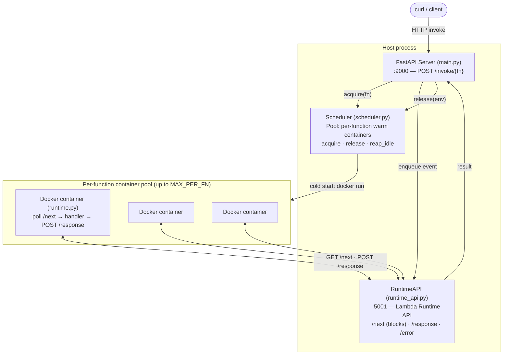
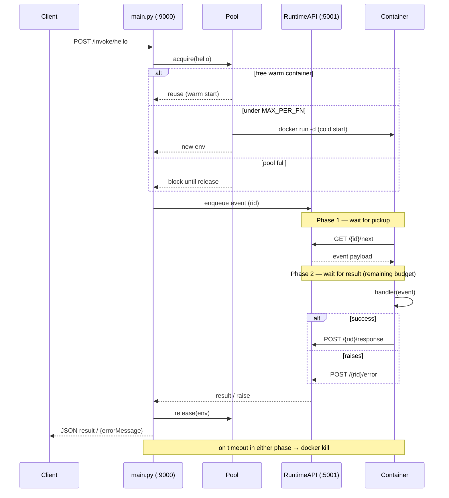

# Local AWS Lambda Implementation

A working implementation of AWS Lambda's core runtime behavior, including:

## ✅ Implemented Features

### 1️⃣ Invocation Timeouts (Hard Kill)

- **Timeout:** 15 seconds (configurable)
- **Behavior:** Container is killed if handler exceeds timeout
- **Implementation:** Host process tracks execution time and sends `docker kill`
- **Just like AWS:** Lambda never trusts user code to exit gracefully

### 2️⃣ Idle Eviction (Warm Container Recycling)

- **Idle timeout:** 30 seconds (configurable)
- **Behavior:** Unused containers are automatically destroyed
- **Implementation:** Background reaper thread checks `last_used` timestamp
- **Just like AWS:** Forces cold starts to prevent long-lived environments

### 3️⃣ Per-Container Event Queues

- Each container gets its own event queue
- Prevents cross-container event stealing
- Container calls `/{container_id}/next` which blocks until event arrives

### 5️⃣ Concurrent Execution (Per-Function Container Pool)

- **Pool:** up to `MAX_PER_FN` (default 3) warm containers **per function**
- **Behavior:** concurrent invokes fan out across the pool; when all are busy, callers block until one frees
- **Implementation:** `Pool` in `scheduler.py` — `acquire`/`release` guarded by a `threading.Condition`; requests run off the event loop via `run_in_threadpool`
- **Just like AWS:** one execution environment serves one request at a time; scale = more environments

### 4️⃣ Container Lifecycle Management

- Cold starts: New container created on first invocation
- Warm reuse: Same container reused for subsequent calls
- Function switching: Old container killed when switching functions
- Proper cleanup: Containers deleted after timeout or eviction

## Architecture



### Invocation Lifecycle (two-phase timeout)



## Usage

### Start Server

```bash
cd server
python main.py
```

### Invoke Function

```bash
curl -X POST http://localhost:9000/invoke/hello \
  -H "Content-Type: application/json" \
  -d '{"name": "World"}'
```

### Create New Function

```bash
mkdir -p functions/myfunction
echo 'def handler(event):
    return {"result": "ok"}' > functions/myfunction/handler.py
echo '{}' > functions/myfunction/event.json
```

## Configuration

**Knobs (scheduler.py):**

```python
MAX_PER_FN = 3    # warm containers per function (concurrency ceiling)
IDLE_TIMEOUT = 30 # seconds idle before a container is evicted
# per-invoke execution timeout: Environment.invoke(payload, timeout=15)
```

## What This Teaches

This is NOT optional Lambda behavior — it's fundamental:

| Feature             | Reason                                               |
| ------------------- | ---------------------------------------------------- |
| Hard timeout kill   | Prevents runaway processes, ensures billing accuracy |
| Idle eviction       | Security (credential rotation), cost control         |
| No persistent state | Forces stateless design, enables horizontal scaling  |
| Container recycling | Allows runtime patches without user intervention     |

**Key lesson:** Lambda execution environments are **ephemeral by design**. Even "warm" containers eventually die.

## Technical Details

### Container ID Handling

- Docker returns 64-char container ID
- Container hostname is only first 12 chars
- Solution: Store short ID for API routing, full ID for `docker kill`

### Event Queue Architecture

- Single global queue → ❌ (events stolen by wrong container)
- Per-container queues → ✓ (isolated event delivery)

### Timeout Implementation

```python
while rid not in self.responses:
    if time.time() - start > timeout:
        subprocess.run(["docker", "kill", container_id])
        raise Exception("Function timed out")
    time.sleep(0.01)
```

### Idle Eviction Thread

```python
def reap_idle():
    while True:
        time.sleep(5)
        POOL.reap_idle()  # evicts idle, non-busy containers across every function pool
```

## Files

- **server/main.py** - HTTP API for invoking functions
- **server/scheduler.py** - Container lifecycle management + idle eviction
- **server/runtime_api.py** - Runtime API that containers call
- **runtime/runtime.py** - Code running inside containers
- **runtime/Dockerfile** - Container image definition
- **functions/hello/handler.py** - Example fast function
- **functions/slow/handler.py** - Example timeout test

## Requirements

```bash
pip install fastapi uvicorn aiofiles requests
docker
```

## Real AWS Lambda Differences

| Feature       | This Implementation              | Real AWS Lambda                 |
| ------------- | -------------------------------- | ------------------------------- |
| Timeout       | 15s                              | 1s - 900s (configurable)        |
| Idle eviction | 30s                              | ~10-60 minutes (varies)         |
| Concurrency   | N per function (pool, default 3) | Thousands (auto-scaling)        |
| Cold start    | ~100ms                           | 100ms - 10s (varies by runtime) |
| Billing       | N/A                              | Per-ms, per-GB memory           |

## Reference

[AWS Lambda Architecture Deep Dive](https://joudwawad.medium.com/aws-lambda-architecture-deep-dive-bef856b9b2c4)

## License

UNLICENSED
